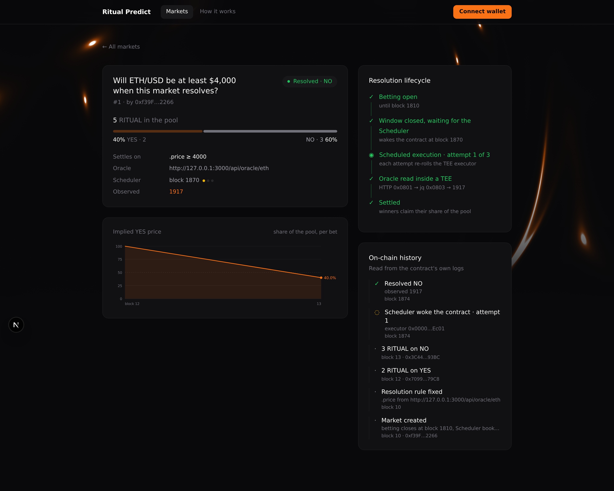
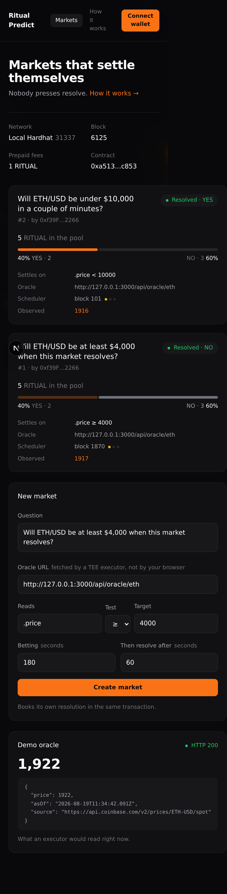

# Fork notes — Proof of Building, Bootcamp 2

What this fork adds to `cozfuttu/ritual-chain-workshop-2`, and how to run all of it
with the testnet unreachable.

Everything below runs offline. `npx hardhat test` needs no RPC and no funded account;
the local runbook needs nothing but a terminal.

---

## What was missing

The starter's `RitualPredict.sol` has five functions replaced by `// we'll fill this up`
— `createMarket`, `_scheduleResolution`, `onScheduledResolve`, `_readOracle` and
`_pickExecutor`. Those are the whole Ritual surface of the contract: the Scheduler
booking, the callback, the HTTP + jq read, and executor selection.

`hardhat/README.md` also documents three files that are not in the repo
(`contracts/RitualPredict.t.sol`, `contracts/mocks/RitualMocks.sol`,
`test/RitualPredict.e2e.ts`), and `scripts/export-abi.ts` writes into a `web/`
directory that does not exist either.

So: implement the five, then build everything the README promises.

---

## What is here now

| | |
|---|---|
| `hardhat/contracts/RitualPredict.sol` | the five functions implemented |
| `hardhat/contracts/mocks/RitualMocks.sol` | Scheduler, RitualWallet, TEE registry, HTTP and jq precompiles as test doubles |
| `hardhat/contracts/RitualPredict.t.sol` | 65 Solidity tests, including two fuzz properties |
| `hardhat/test/RitualPredict.e2e.ts` | 4 end-to-end walkthroughs |
| `hardhat/scripts/local-stack.ts` | installs the Ritual system contracts on a plain EVM node |
| `hardhat/scripts/local-demo.ts` | the whole lifecycle, narrated, offline |
| `hardhat/scripts/local-serve.ts` | sets up a local chain for the frontend |
| `hardhat/scripts/local-executor.ts` | plays Scheduler + TEE executor locally |
| `web/` | the market UI, the market detail screen and the demo oracle |

```
$ npx hardhat test
69 passing (65 solidity, 4 nodejs)

$ npx tsc --noEmit
(clean)
```

---

## Implementation notes

Decisions the starter left open, and why they went this way:

**`resolveBlock` is measured from `closeBlock`, not from now.** Converting
`bettingSeconds + resolveDelaySeconds` in one go lets both land on the same block when
the durations round down, which would let the Scheduler fire while betting is still
open. Measuring the delay from the close block makes `resolveBlock > closeBlock` an
invariant instead of a coincidence — `test_ResolveBlockAlwaysFollowsCloseBlock` pins it
with a deliberately absurd block time.

**`createMarket` reverts if the Scheduler refuses the booking.** A market that exists
but can never resolve is worse than no market: bets would go in with no way out. The
market and its resolution are created in one transaction or not at all.

**`onScheduledResolve` returns instead of reverting for everything except an auth
failure.** A revert rolls back `m.attempts`, and a market whose attempt counter never
advances can never reach `Invalid`, so every stake would be locked forever. Unknown
market, early trigger, already-settled: all no-ops.

**The executor seed is re-rolled per attempt** — `keccak256(marketId, executionIndex,
block.number)` — so a retry does not keep landing on the same unhealthy executor.

**A failed read is never a NO.** Precompile failure, non-200, executor error message,
undecodable envelope and unparseable body are all failures. After three the market
becomes `Invalid` and everyone refunds. This is the property most worth protecting, so
it has six tests.

---

## Testing

Ritual's capabilities live at fixed addresses, so a test cannot inject a different
implementation — it has to put one *at those addresses*. The Solidity suite does that
with `vm.etch`, the TypeScript suite with `hardhat_setCode`. What runs on top is the
real contract, the real 13-field encoding and the real callback path.

Three things cost real debugging time and are worth passing on:

1. **`abi.encode(a, b, c)` is not `abi.encode(Struct(a, b, c))`.** A struct with dynamic
   members is itself a dynamic type, so encoding one prepends an offset word that the
   flat precompile layout does not have. Decoding the HTTP request as a struct made
   every call revert, and the contract reported it as `http precompile call failed`.
2. **Decoding all 13 HTTP fields in one `abi.decode` blows the stack.** The mock decodes
   valid prefixes in scoped blocks and reads the static tail fields straight out of
   calldata.
3. **A jq mock cannot write storage.** `_jqUint` uses `STATICCALL`, which reverts the
   moment a callee touches state — and the failure surfaces as a misleading
   `jq parse failed`.

`MockScheduler.fire` swallows a failed callback the way the chain does. That is
faithful, but it also fools `eth_estimateGas` into reporting the cost of a run whose
inner call ran out of gas, so the callback silently never happens. `fireStrict` bubbles
the revert instead and is what the tests and scripts use.

---

## Offline runbook

Four terminals, no network:

```bash
cd hardhat
npx hardhat node                              # 1. a plain EVM node

npx hardhat run scripts/local-serve.ts        # 2. install Ritual, deploy, open a market
PREDICT_ADDRESS=0x… npx hardhat run scripts/local-executor.ts   # 3. Scheduler + executor

cd ../web && npm run dev                      # 4. the UI, on http://localhost:3000
```

`local-serve.ts` writes `web/.env.local`, prepays the contract's execution fees, opens a
demo market with two stakes in it, and switches the node to one block per second so the
countdowns move on their own.

`local-executor.ts` is the honest part of the offline story. On the real chain the
Scheduler fires the booked execution and an attested executor fetches the oracle inside
an enclave. Locally, that loop watches for markets that have reached their resolve
block, fetches the market's own oracle URL over plain HTTP, queues the response into the
HTTP precompile mock and runs the execution. The contract, its encoding and its callback
are untouched — only the two off-chain roles are stood in for.

For the lifecycle without a UI:

```bash
npx hardhat run scripts/local-demo.ts
```

Act 1 creates a market, takes bets from three accounts, lets the betting window close by
itself, fires the scheduled resolution and pays the winners. Act 2 points a market at an
oracle that never answers, burns all three booked attempts and refunds everyone.

---

## Bugs found in the starter

Each of these breaks a path the README tells you to walk:

| Symptom | Cause | Fix |
|---|---|---|
| `npx hardhat test` fails before running anything | `test/Counter.ts` is left over from the Hardhat template and references a `Counter` contract that is not in the repo | removed |
| `npx tsc --noEmit` fails on the starter's own scripts | every script imports `./ritual.ts`, which needs `allowImportingTsExtensions` + `noEmit` | added, plus `strict` |
| Deploy prompts for a key on stdin with a correctly filled `.env` | `.env` was never loaded — nothing calls `process.loadEnvFile` or dotenv | loaded in `hardhat.config.ts` |
| …and asks for the wrong variable | the network reads `DEPLOYER_PRIVATE_KEY`; `.env.example` and `scripts/ritual.ts` both say `RITUAL_PRIVATE_KEY` | renamed to match the docs |
| `RITUAL_RPC_URL` documented but ignored | the RPC URL was hardcoded | wired |
| A second local run inherits the previous run's oracle responses | `hardhat_setCode` replaces code but keeps storage, and the mock queue's last entry is sticky | `installRitualMocks` clears it |
| The UI hangs on "Reading the chain…" with nothing in the terminal | the Next dev server answers **403 to its own JS chunks** when the page is opened from a host it does not recognise, and the runbook points at `127.0.0.1` | `allowedDevOrigins` |

---

## Frontend

`web/` is Next.js + viem, no wallet-connect stack: one chain, one injected connector.

Its tokens are lifted from Ritual's own builder site (skills.ritualfoundation.org), so
this app and their docs read as the same product: near-neutral zinc surfaces, one orange
accent, three status colours, Inter throughout. The restraint is the design — orange
appears on the primary action, the live oracle number and the price line, and almost
nowhere else. Status never rides on colour alone: every state ships a dot, a word, and
for a settled market its outcome.

Three screens, split so the one people act on stays about acting:

- **Markets** — every market with its pool, its resolution rule, the Scheduler booking
  and a live countdown; a create form validated against the contract's own limits; and
  the demo oracle showing what an executor would read right now.
- **One market** — the implied YES price after every bet, where the market sits in the
  run it booked for itself, and its whole history read from the contract's logs. There
  is no indexer and no backend behind any of it.
- **How it works** — the loop, the precompiles involved, what happens when the oracle
  goes quiet, and the questions that kept coming up. Everything explanatory lives here
  rather than as paragraphs wrapped around the controls.

A molten field sits behind the page (React Bits' MoltenMetal, MIT), masked so it is
strongest behind the header and dimmed to a quarter on the prose page. Cards lean a few
degrees toward the pointer with a sheen that follows it. Both stop for anyone who asked
for reduced motion, and the tilt never runs on a coarse pointer.

The price chart is one series rather than a YES/NO pair on purpose. The second colour
would have to be a grey, which reads as "no category" and fails a categorical palette
check; one line carries the same information, because NO is its complement.

| Markets | One market |
|---|---|
|  |  |

| How it works | Mobile |
|---|---|
|  |  |

Every screenshot is a local run, not a mockup: the block height, the pool and the
observed value are read from the node, and the oracle number is a live ETH price.

## Not done

- No deployment to Ritual Chain: the testnet was unreachable while this was built, so
  every claim here is backed by a local run rather than an explorer link.
- The contract is unaudited workshop code. `claimWinnings` pays with a raw `call`, and
  while the settled flag is written before the transfer, this has had no adversarial
  review.
- `getMarkets()` is unbounded. Fine for a workshop, wrong for a chain with real usage.
